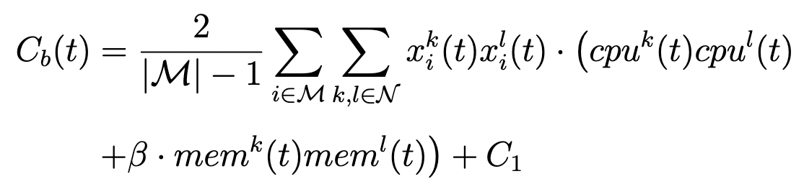
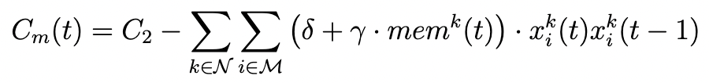
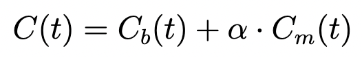
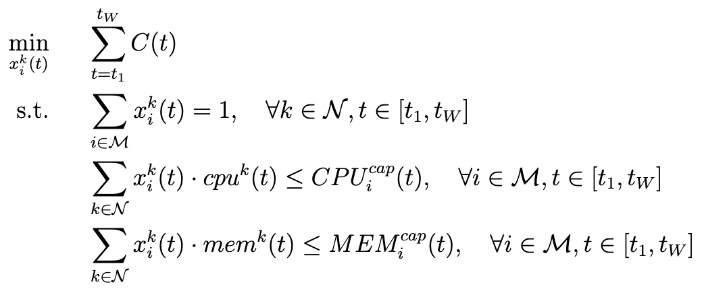

# ***Tetris***
*Tetris*, a model predictive control (MPC)-based container scheduling strategy to judiciously migrate long-running workloads for cluster load balancing.


## Prototype of *Tetris*
*Tetris* comprises three pieces of modules including a container resource predictor, a MPC-based container scheduler and a container migration module of K8s. After users submit workload requests to the containerized cluster, *Tetris* first leverages the predictor to estimate the resource consumption of containers over a given time window $W$, which is input to the scheduler for calculating the scheduling cost of containers. By jointly optimizing the cluster load balancing degree and container migration cost, the scheduler further decides the appropriate migration plans during the period of time window $W$. Finally, the container migration module of K8s performs the appropriate migration decisions for the first timeslot in the containerized cluster, while discarding the migration decisions for the remaining timeslots. In particular, such a migration module can convert container scheduling decisions into a series of K8s pod operations (i.e., pod deletion and creation commands executed on migration source and destination servers).


## Model the Workload Scheduling Optimization Problem
As *Tetris* aiming to jointly optimize the load imbalance degree and migration cost, we first build a discrete-time dynamic model to capture the load imbalance degree of clusters and migration cost of containers and next formulate a container scheduling optimization problem based on the dynamic model.

By using the variance of resource consumption of all cluster servers to represent the load imbalance degree of the cluste, we can modele the cluster load imbalance degree at each timeslot as

<div align=center></div>

To denote the migration cost by the sum of unit cost of the migrated containers, the migration cost is formulated as

<div align=center></div>

To sum up, we further formulate the cost function $C(t)$ of container scheduling at each timeslot. Based on the formulations above, we further combine the cluster load imbalance degree and the migration cost as below,

<div align=center></div>

Based on our discrete-time dynamic model above, we proceed to formulate the long-term optimization problem of container scheduling based on MPC. At each time $t$, MPC leverages the predicted container resource consumption (i.e., $cpu^{k}(t)$, $mem^{k}(t)$) to make scheduling decisions (i.e., judiciously deciding $x_{i}^{k}(t)$) to minimize the cost function $C(t)$ over the time window. We assume the scheduling starts at time $t_{1}$, and our optimization problem can be formulated as

<div align=center></div>


## Dependencies
1. Containerd 1.6.6
2. Kubernetes 1.24.3
3. Python 3.8.8
4. numpy
5. pandas
6. matplotlib
7. sklearn
8. scipy
9.  simpy
10. pyDOE


## Content
The project of *Tetris* includes two parts:
1. **Simulator_Alibaba_trace**: The trace-driven simulator based on Alibaba cluster trace v2018.
2. **Prototype-K8s**: The prototype system of *Tetris* based on K8s.


## Installation
```
$ git clone https://github.com/icloud-ecnu/Tetris.git
$ cd Tetris
$ python3 -m pip install --upgrade pip
$ pip install -r requirements.txt
```


## Run the Trace-Driven Simulator
### Download the dataset from ***Alibaba cluster trace v2018***
Run the script to download the processed dataset:
1. If you want to get the data in 1 hour,
    ```
    $ cd Tetris/Simulator_Alibaba_trace/data/
    $ ./data_download_1h.sh
    ```

2. If you want to get the data in 10 seconds,
    ```
    $ cd Tetris/Simulator_Alibaba_trace/data/
    $ sh ./data_download_10s.sh
    ```


[//]: #仿真
### Run the ***simulator***
```
$ cd Tetris/Simulator_Alibaba_trace
$ python3 main.py
```

After you run the script, you will get the results in ```Tetris/Simulator_Alibaba_trace/metric/```, which is a CSV file. 

*Noted that if you want to use the data in 10 seconds in experiments, please replace ```filepath = './data/resource_1h/'``` in ```main.py``` with ```filepath = './data/resource_10s/'```.


[//]: #原型
## Run the Prototype System
### Send ***requests***
Run the commands to send requests to Apache Tomcat server:
```
$ sudo apt-get update
$ sudo apt-get install apache2-utils

$ cd Tetris/Prototype-K8s
$ sh request.sh
```
*Remember to replace the IP address in ```request.sh``` with the IP address of the master in your own K8s cluster.

### Run the ***prototype***
```
$ cd Tetris/Prototype-K8s
$ nohup python3 -u ./runk8s.py --algo=sxy > ./log/runk8s_sxy.log &
```

After you run the script, you will get the log in ```Tetris/Prototype-K8s/log/``` which is a *.txt* file, and the results in ```Tetris/Prototype-K8s/metric/```, which is a *.csv* file. 


## Understanding the Results
After the program runs, the information and running results of container migrations will be output on the screen and also be stored in the specified path (see above for details). The files can show different metrics of the algorithm, whose meanings are as follows:

| clock | eval_bal | eval_mig | sum | sums | violation |
| ----- | -------- | -------- | --- | ---- | --------- |
| Timeslot | The load imbalance degree in this timeslot | The migration cost in this timeslot | The value of the optimization objective in this timeslot | The cumulative value of the optimization objective | The number of SLO violations in this timeslot |


## Publication
Xiyue Shen, Fei Xu, Yifan Liu, Tao Song, Shuohao Lin, Li Chen, Fen Xiao, "[*Tetris*: Scheduling Long-Running Workloads for Load Balancing in Shared Containerized Clusters](https://github.com/icloud-ecnu/Tetris/raw/main/pdf/main.pdf)," submitted to Journal of Parallel and Distributed Computing, 2022.
